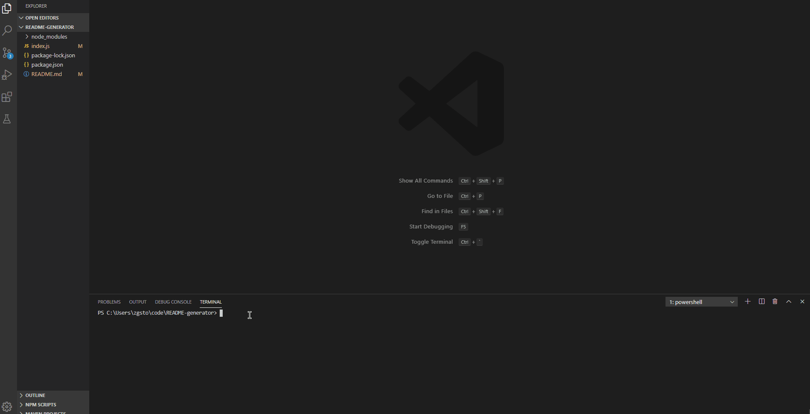

# README Generator
 
## Description: 
A command-line application that dynamically generates a README.md from a user's input. The generated file includes a licensing badge and an optional Contributor Covenant badge. 
 

## Contributing: 

## Installation: 
npm install for "axios", "inquirer" and "util" nodes 
 
## Questions: 

* Email: <zgstowell@gmail.com>
 
* [GitHub Profile](https://github.com/the-medium-place)

